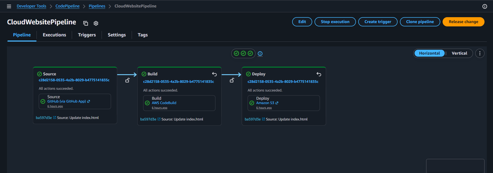
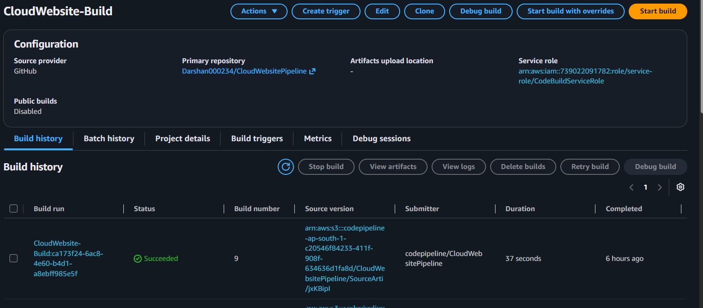
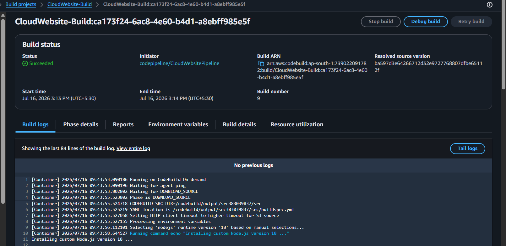

# 🚀 Cloud Website CI/CD Pipeline using AWS CodePipeline

## 📌 Project Overview

This project demonstrates a complete Continuous Integration and Continuous Deployment (CI/CD) pipeline using AWS services.

Whenever a developer pushes changes to the GitHub repository, AWS CodePipeline automatically detects the changes, starts AWS CodeBuild to validate the HTML files, and finally deploys the latest website to an Amazon S3 bucket configured for Static Website Hosting.

The entire deployment process is fully automated without requiring any manual upload to S3.

---

# 📖 Project Workflow

```
        Developer
             │
             │ git push
             ▼
      GitHub Repository
             │
             ▼
     AWS CodePipeline
             │
             ▼
      AWS CodeBuild
             │
     Install HTMLHint
             │
             ▼
     Validate HTML Files
             │
             ▼
      Build Successful
             │
             ▼
      Amazon S3 Bucket
             │
             ▼
 Static Website Hosting
             │
             ▼
      Live Website Updated
```

---

# ☁️ AWS Services Used

| Service | Purpose |
|----------|----------|
| GitHub | Source Code Repository |
| AWS CodePipeline | Automates CI/CD Pipeline |
| AWS CodeBuild | Builds and Validates HTML |
| Amazon S3 | Hosts Static Website |
| IAM | Provides Required Permissions |

---

# 📂 Project Structure

```
CloudWebsitePipeline/
│
├── index.html
├── about.html
├── contact.html
├── styles.css
├── script.js
├── buildspec.yml
├── README.md
└── images/
    ├── pipeline-success.png
    ├── build-history.png
    └── build-log.png
```

---

# ⚙️ Build Process

AWS CodeBuild uses the following `buildspec.yml`

```yaml
version: 0.2

phases:
  install:
    runtime-versions:
      nodejs: 18
    commands:
      - echo "Installing HTMLHint..."
      - npm install -g htmlhint

  pre_build:
    commands:
      - echo "Checking HTML files..."
      - htmlhint "**/*.html"

  build:
    commands:
      - echo "HTML validation successful."

artifacts:
  files:
    - '**/*'
```

---

# 🔄 Deployment Workflow

### Step 1

Developer updates the website locally.

↓

### Step 2

Developer pushes code to GitHub.

↓

### Step 3

GitHub automatically triggers AWS CodePipeline.

↓

### Step 4

CodePipeline downloads the latest source code.

↓

### Step 5

AWS CodeBuild installs HTMLHint.

↓

### Step 6

All HTML files are validated.

↓

### Step 7

If validation succeeds, the build artifact is created.

↓

### Step 8

CodePipeline deploys the latest files to Amazon S3.

↓

### Step 9

The S3 Static Website is updated automatically.

---

# 📸 Project Screenshots

## 1. Successful Pipeline Execution



---

## 2. CodeBuild History



---

## 3. Build Logs



---

# 📈 Pipeline Stages

```
      GitHub

        │

        ▼

    CodePipeline

        │

        ▼

    CodeBuild

        │

        ▼

  HTML Validation

        │

        ▼

  Build Success

        │

        ▼

    Amazon S3

        │

        ▼

  Website Updated
```

---

# ✅ Features

- Automatic Deployment
- Continuous Integration
- Continuous Deployment
- HTML Validation
- Static Website Hosting
- AWS CodePipeline
- AWS CodeBuild
- Amazon S3
- GitHub Integration
- Zero Manual Deployment

---

# 🎯 Benefits

- Eliminates manual deployment
- Reduces deployment time
- Detects HTML errors before deployment
- Fully automated deployment
- Easy to maintain
- Beginner-friendly AWS DevOps project

---

# 🛠 Technologies Used

- HTML5
- CSS3
- JavaScript
- Git
- GitHub
- AWS CodePipeline
- AWS CodeBuild
- Amazon S3
- IAM

---
